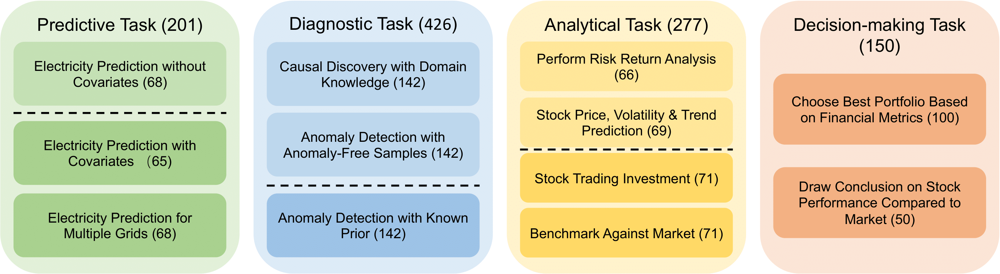

# TSAIA-Bench

This repository contains code and instructions for setting up and running experiments using various LLMs on the **TSAIA-Bench** dataset.



## 🚀 Quick Start

### 1. Clone the Repository

```
git clone https://github.com/llll121/TSAIA-Bench.git
cd TSAIA-Bench
```

### 2. Set up Conda Environment

```
conda env create -f agent_environment.yml
conda activate agentenv
```

### 3. Configure API Keys

Create a secure API key file `my_api_keys.py` by running:
```
printf '%s\n' '# my_api_keys.py  --  DO NOT COMMIT TO GIT' '# Fill in your API Token' '' 'OPENAI_API_KEY = "your_openai_key_here"' 'DEEPSEEK_API_KEY = "your_deepseek_key_here"' 'GEMINI_API_KEY = "your_gemini_key_here"' 'QWEN_API_KEY = "your_qwen_key_here"' 'CODESTRAL_API_KEY = "your_codestral_key_here"' 'MISTRAL_API_KEY = "your_mistral_key_here"' 'CLAUDE_API_KEY = "your_claude_key_here"' 'LLAMA_API_KEY = "your_llama_key_here"' > my_api_keys.py && chmod 600 my_api_keys.py
```

> ⚠️ **Important**: Replace placeholders (`your_..._key_here`) in `my_api_keys.py` with your actual API keys. Ensure this file is never committed to git.

### 4. Download Raw Dataset

This command downloads the raw dataset from our Hugging Face repository ([Melady/TSAIA](https://huggingface.co/datasets/Melady/TSAIA)) into the directory `./data/raw_data`.
```
git clone https://huggingface.co/datasets/Melady/TSAIA ./data/raw_data
```

### 5. Generate Pickle Files

Running `get_pkl.py` converts the raw dataset downloaded in the previous step into two .pkl files and stores them under the `./data` directory.
```
python get_pkl.py
```

## 🔬 Running Experiments

Activate your conda environment (`agentenv`) before running experiments.
The following two commands use the GPT-4o model. Ensure that you have set a valid OpenAI API key for `OPENAI_API_KEY` in your `my_api_keys.py` file.

* **Analysis Questions:**

```
python3 -u static_query_codeact.py --question_path data/analysis_questions.pkl --model_id gpt-4o
```

* **Multiple Choice Questions:**

```
python3 -u static_query_CodeAct_mc.py --question_path data/multiple_choice.pkl --model_id gpt-4o
```

## 📁 Project Structure

```
TSAIA-Bench
├── agent_environment.yml          # Conda environment setup
├── data
│   ├── raw_data                   # Raw data from Hugging Face
│   ├── analysis_questions.pkl     # Preprocessed analysis questions data
│   └── multiple_choice.pkl        # Preprocessed multiple-choice data
├── get_pkl.py                     # Preprocessing script
├── static_query_codeact.py        # Analysis questions experiment
├── static_query_CodeAct_mc.py     # Multiple-choice questions experiment
└── my_api_keys.py                 # API keys file (private)
```

## 🛡️ Security

Never commit your API keys. Ensure the file is secure:

```
echo "my_api_keys.py" >> .gitignore
```

## 📖 Reference

* Dataset: [Melady/TSAIA](https://huggingface.co/datasets/Melady/TSAIA)

## 🙌 Contributing

Contributions are welcome! Please open issues or pull requests for improvements or questions.

---

🎉 **Happy experimenting!**
